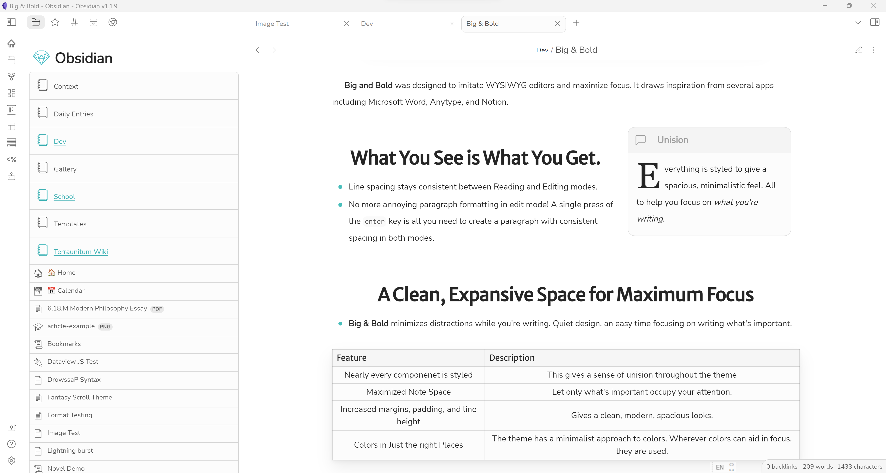
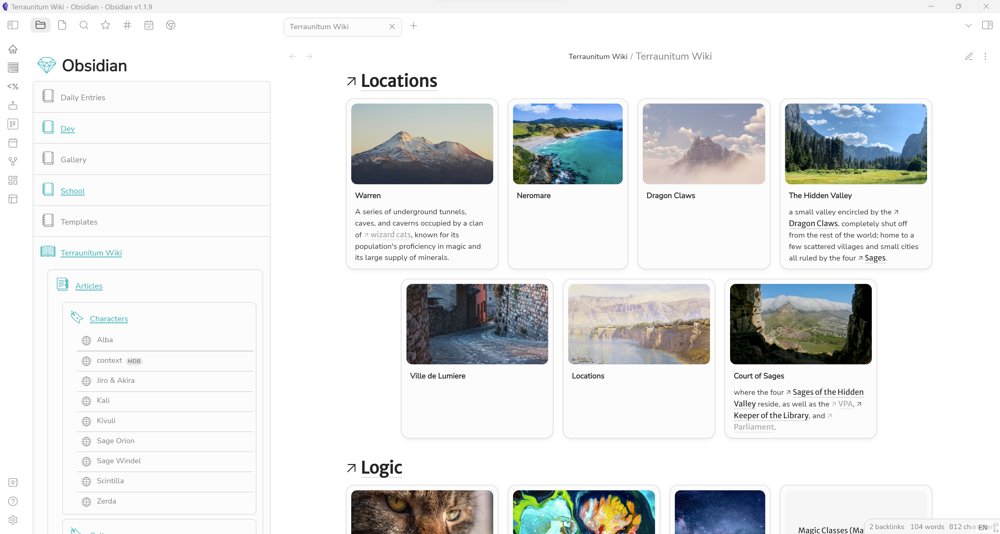
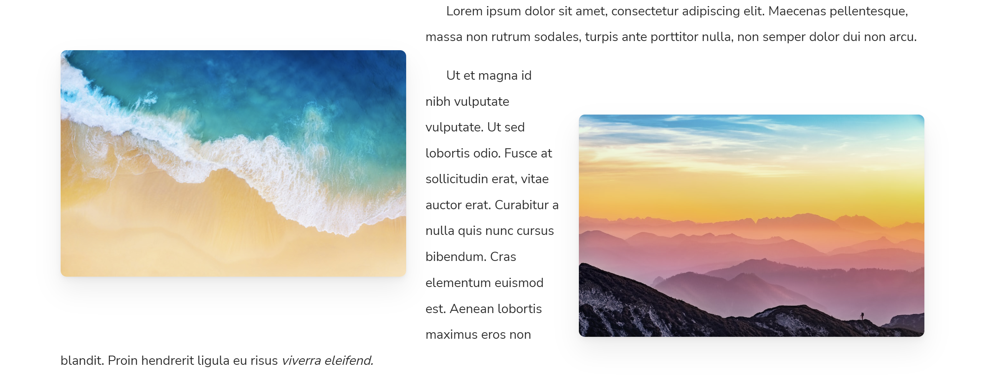
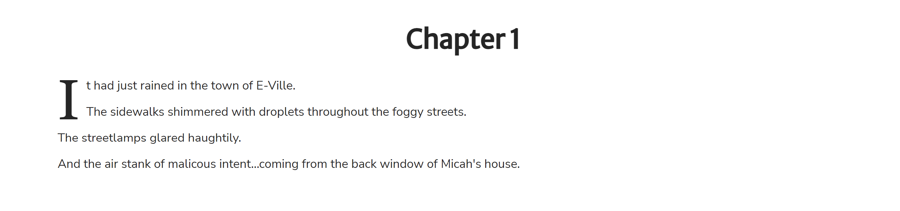
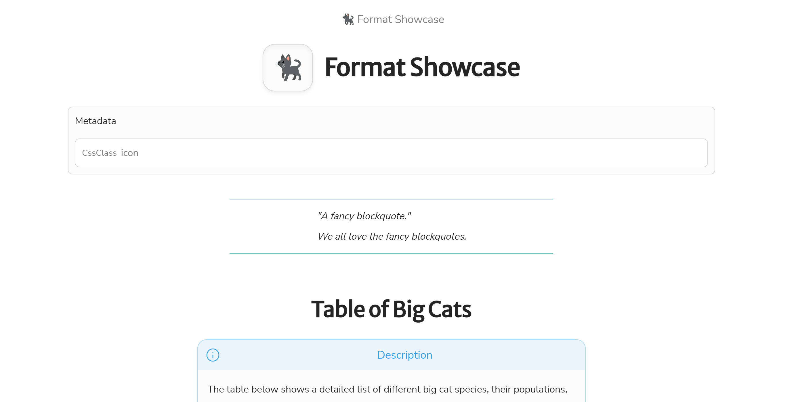
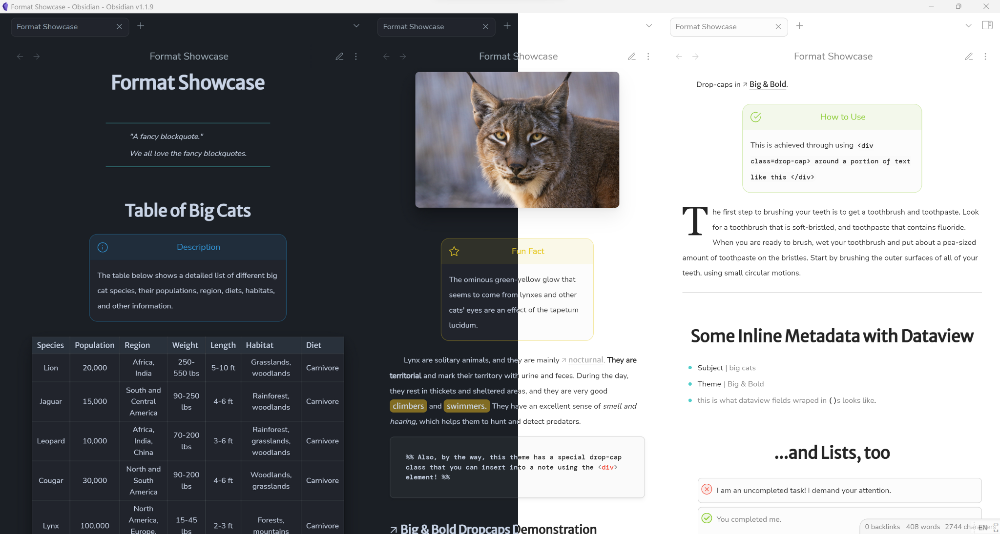

**Big and Bold** was designed to imitate WYSIWYG editors and maximize focus. Drawing inspiration from several apps including Microsoft Word, Anytype, and Notion, this theme was built for long periods of uninterrupted, highly concentrated writing.

# What You See is What You Get.
My first goal for **Big and Bold** was to make Obsidian look as not-Obsidian as possible. I probably could have pushed it much further, but the main way I decided to execute this was by imitating a WYSIWYG editor.

Paragraphs in live preview and reading mode are spaced in exactly the same way. Whether you press `Enter` once or twice, a properly spaced paragraph, identical to all other paragraphs, will be created (although you still need to press `Enter` twice to indent).

No inconsistencies, no surprises with paragraphs. Just keep writing and focus on writing.

# An Expansive Space
When you are using **Big and Bold**, the note pane takes up as much space on the screen as possible. Distractions are minimized and the note itself is made the focal point. No more messing around with plug-ins in the sidebar while you're supposed to be writing that paper. No more getting lost in your graph view while you're meant to be taking Science notes. And hopefully, no more opening the developer tools and staying up 'till 3:00 AM making a theme when you're supposed to be speedrunning your math assignments, because you'll be so deeply engulfed on what **really matters**--the note in front of you.

# A Unified Experience

Almost every element in Obsidian has been styled for you. Even **Dataview tables**, **Page Gallery** cards, and **Database Folder** tables are reworked with care to give you *the best*, most unified Obsidian experience.



## Some Components with Special Styles
* Lists: bulleted lists and numbered lists' markings change colors with every indentation level to help you keep track of ideas in an outline.
* Tables: clean and spacious. Also consistent with **Dataview** tables.
* Page Gallery cards
* Tags: `#note`, `#to-do`, `#reminder`, `#important`, and a few other tags automatically gain emoji icons. Keep track of your reminders!
* Sidebar: Panel-like folders and subfolders with icons that change with each level - from books to pages to bookmarks. Designed this way simply to look as not-Obsidian as possible (I'm not that creative).
* Files: Some notes gain special icons depending on what words they have in their file location (`Adventures of Darrel Wiki/Darrel.md` gets a little `🌐` Wiki icon).
* Callouts: Tweaked some colors and svg icons. Also, the quote/cite callout floats to the right and has fancy drop caps.
* Checkboxes: Unchecked checkboxes show up as red ❌s. Don't forget to complete those tasks!
* ...and much more!

## Other Features

### Float Images
> Use the alt `right` or `left` to float an image into the corresponding position.


#### Example
```markdown


```


### Drop Caps
> `[!quote]` and `[!cite]` callouts automatically contain them, but drop caps can also be inserted anywhere on the page using `<div>` elements.

```markdown
# Chapter 1
  
<div class=drop-cap> It had just rained in the town of E-Ville.
  The sidewalks shimmered with droplets throughout the foggy streets.
  The streetlamps glared haughtily.
  And the air stank of malicous intent...coming from the back window of Micah's house. </div>
```
The result is a drop cap on the first letter of the first paragraph contained within the `<div>`.



### Note Title Icons
> Display the first character in a note title as an icon.



Put `cssClass: icon` in a note's frontmatter to display the first character in the title as an icon. Recommended for notes in which the first character is an emoji.

# Coming Soon
- [ ] Fixes to mobile
- [x] Style Settings Support
  - [ ] More Options to Control the Degree of Minimalism
  - [ ] Might go crazy with color schemes again. 

# Warning
I'm not a theme developer, just a 15-year-old who likes messing around with CSS instead of doing my homework. But this time it's worth it, because it will help me focus on my homework. Anyway, I'm not a professional, so expect some issues here and there. Don't be shy to submit a pull request or an issue to help me improve this theme! 

> ## It's also under Creative Commons, so do whatever you want with it!


